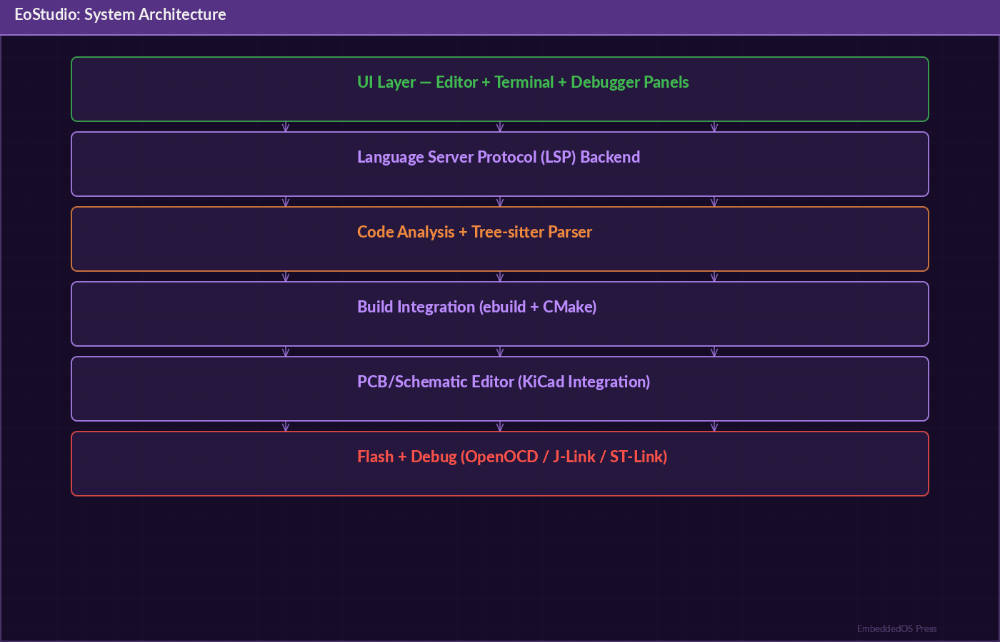

---

# EoStudio — Cross-Platform Design Suite

## The Definitive Technical Reference




**Version 1.0**

**Srikanth Patchava & EmbeddedOS Contributors**

**April 2026**

---

*Published as part of the EmbeddedOS Product Reference Series*

*MIT License — Copyright (c) 2026 EmbeddedOS Organization*

---

# Preface

EoStudio is the unified design tool suite for the EmbeddedOS ecosystem. It brings together 3D modeling, CAD design, image editing, game design, UI/UX flow design, interior design, UML modeling, MATLAB-style simulation, database design, hardware PCB layout, code editing, and LLM-powered AI assistance — all in a single cross-platform application running on Windows, Ubuntu/Linux, macOS, EoS, and the browser.

This reference book is intended for designers, developers, engineers, and educators who use EoStudio to create, prototype, and generate production code across a wide [@ide_survey] range of domains. Whether you are designing a responsive web dashboard, modeling a mechanical bracket for 3D printing, creating a game prototype, or using the AI design agent to generate UI layouts from natural language, this book provides complete technical coverage.

EoStudio is built on a modular architecture with 12 specialized editors, 30+ code generators, a plugin system, and deep AI/LLM integration. The rendering pipeline supports Tkinter (desktop), WebSocket-based web rendering, framebuffer/SDL2 for EoS, and native macOS backends. The geometry engine includes Vec2/3/4, Matrix4, Mesh, Bezier, NURBS, and CSG operations. The AI subsystem supports both local models via Ollama and cloud models via the OpenAI API.

We hope this reference helps you unlock the full potential of EoStudio for your design and engineering workflows.

— *Srikanth Patchava & EmbeddedOS Contributors, April 2026*

---

# Table of Contents

1. [Introduction](#chapter-1-introduction)
2. [Getting Started](#chapter-2-getting-started)
3. [System Architecture](#chapter-3-system-architecture)
4. [CLI Reference](#chapter-4-cli-reference)
5. [3D Modeler Editor](#chapter-5-3d-modeler-editor)
6. [CAD Designer Editor](#chapter-6-cad-designer-editor)
7. [Image Editor](#chapter-7-image-editor)
8. [Game Editor](#chapter-8-game-editor)
9. [UI/UX Designer Editor](#chapter-9-uiux-designer-editor)
10. [Additional Editors](#chapter-10-additional-editors)
11. [Code Generation](#chapter-11-code-generation)
12. [AI & LLM Integration](#chapter-12-ai--llm-integration)
13. [Geometry & Rendering Engine](#chapter-13-geometry--rendering-engine)
14. [Platform Backends](#chapter-14-platform-backends)
15. [Plugin System](#chapter-15-plugin-system)
16. [Project Templates](#chapter-16-project-templates)
17. [File Formats](#chapter-17-file-formats)
18. [Configuration Reference](#chapter-18-configuration-reference)
19. [API Reference](#chapter-19-api-reference)
20. [Testing](#chapter-20-testing)
21. [Troubleshooting](#chapter-21-troubleshooting)
22. [Glossary](#chapter-22-glossary)

---

# Chapter 1: Introduction

## 1.1 What is EoStudio?

EoStudio is a cross-platform design suite that unifies 12 specialized editors for 3D modeling, CAD, image editing, game design, UI/UX, interior design, UML, simulation, database design, hardware PCB, and code editing — with integrated LLM-powered AI assistance and 30+ code generators.

It is a core component of the EmbeddedOS ecosystem, designed to streamline the entire design-to-code workflow for embedded systems, applications, and cross-platform products.

## 1.2 Key Capabilities

| Capability | Description |
|---|---|
| 12 editors | 3D, CAD, Image, Game, UI/UX, Product, Interior, UML, Simulation, Database, Hardware, IDE |
| 30+ code generators | Mobile, desktop, web, database, UML, 3D/CAD, game engines, firmware |
| AI integration | Design agent, smart chat, AI generator, AI simulator, kids tutor |
| Cross-platform | Windows, Linux, macOS, EoS, Browser |
| Plugin system | Extensible with custom tools, editors, and exporters |
| LLM backends | Ollama (local) + OpenAI API (cloud) |
| 5 project templates | Todo app, mechanical part, game platformer, IoT dashboard, PID simulation |

## 1.3 Design Philosophy

1. **Unified workflow** — One tool for the entire design pipeline, from concept to production code.
2. **AI-first** — LLM integration in every editor for intelligent assistance and generation.
3. **Code generation** — Designs are not just visual artifacts; they produce real, deployable code.
4. **Cross-platform** — Same experience across Windows, Linux, macOS, EoS, and browser.
5. **Extensible** — Plugin system for custom domain-specific tools and exporters.

## 1.4 Use Cases

- **Embedded UI design** — Design touchscreen interfaces for embedded devices and generate LVGL/EoS code
- **Mechanical engineering** — CAD modeling with parametric design and 3D print export (STL/OBJ)
- **Web/mobile development** — Design UI components and generate React, Flutter, or Swift code
- **Game prototyping** — Create game levels with ECS, tilemaps, and export to Godot/Unity/Unreal
- **Database design** — Model ERDs and generate SQL schema, SQLAlchemy, Prisma, or Django models
- **Education** — Kids learning mode with interactive lessons, quizzes, and encouragement
- **Simulation** — MATLAB-style block diagrams with PID controllers, signal analysis, and ODE solvers

---

# Chapter 2: Getting Started

## 2.1 Prerequisites

- **Python**: 3.10 or later
- **pip**: Latest version recommended
- **Optional**: Node.js (for web code generation), Ollama (for local LLM)

## 2.2 Installation

```bash
# Clone and install
git clone https://github.com/embeddedos-org/EoStudio.git
cd EoStudio
pip install -e ".[all]"
```

### Install Profiles

| Profile | Command | Includes |
|---|---|---|
| Minimal | `pip install -e .` | Core editors, basic codegen |
| Full | `pip install -e ".[all]"` | All editors, all codegen, AI |
| Dev | `pip install -e ".[dev,all]"` | Full + test + lint tools |

## 2.3 Quick Start

```bash
# Launch the design suite
EoStudio launch

# Create a project from template
EoStudio new --template todo-app -o ./my-app

# Generate React code from a design
EoStudio codegen my-app/todo-app.eostudio --framework react -o ./output

# Ask the AI design agent
EoStudio ask "Design a responsive dashboard with charts"

# Kids learning mode
EoStudio teach --lesson shapes

# Launch a specific editor
EoStudio launch --editor 3d
EoStudio launch --editor cad
EoStudio launch --editor ui
```

## 2.4 First Project

Here is a complete workflow for creating a todo app:

```bash
# 1. Create project from template
EoStudio new --template todo-app -o ./my-todo

# 2. Open in the UI/UX editor
EoStudio launch --editor ui --project ./my-todo

# 3. Generate React code
EoStudio codegen ./my-todo/todo-app.eostudio --framework react -o ./react-app

# 4. Generate Flutter code
EoStudio codegen ./my-todo/todo-app.eostudio --framework flutter -o ./flutter-app

# 5. Ask AI for improvements
EoStudio ask "Add dark mode toggle to the todo app design"
```

---

# Chapter 3: System Architecture

## 3.1 Architectural Overview

```
eostudio/
├── cli/               # Click CLI (10 commands)
├── core/
│   ├── ai/            # LLMClient, DesignAgent, SmartChat, AIGenerator, AISimulator, Tutor
│   ├── geometry/      # Vec2/3/4, Matrix4, Mesh, Bezier, NURBS, CSG
│   ├── rendering/     # Rasterizer, scene graph, camera, Phong lighting
│   ├── physics/       # Rigid body, collision, particles
│   ├── cad/           # Parametric design, constraints, assembly
│   ├── simulation/    # Block diagrams, PID, signals, ODE solver
│   ├── uml/           # 5 diagram types + code generation
│   ├── game/          # ECS, tilemap, sprites, scripting
│   ├── image/         # Layers, brushes, filters
│   ├── hardware/      # PCB, schematic, Gerber
│   ├── ui_flow/       # Component library, prototyping
│   └── interior/      # Floor plans, furniture
├── gui/
│   ├── editors/       # 12 visual editors
│   ├── widgets/       # Viewport, canvas, timeline, properties
│   └── dialogs/       # Export, settings, AI chat
├── codegen/           # 30+ framework code generators
├── formats/           # .EoStudio, OBJ, STL, SVG, glTF, DXF
├── plugins/           # Plugin system + EoSim integration
└── templates/         # 5 project templates
```

## 3.2 Component Architecture

```
┌─────────────────────────────────────────────────────────┐
│                     CLI (Click)                          │
│  launch │ new │ codegen │ ask │ teach │ export │ plugin  │
└───────────────────────┬─────────────────────────────────┘
                        │
┌───────────────────────▼─────────────────────────────────┐
│                    GUI Layer                              │
│  ┌────────────────────────────────────────────────────┐  │
│  │              12 Visual Editors                      │  │
│  │  3D │ CAD │ Image │ Game │ UI │ Product │ Interior │  │
│  │  UML │ Simulation │ Database │ Hardware │ IDE      │  │
│  └────────────────────┬───────────────────────────────┘  │
│  ┌────────────────────▼───────────────────────────────┐  │
│  │              Widgets                                │  │
│  │  Viewport │ Canvas │ Timeline │ Properties │ Chat  │  │
│  └────────────────────────────────────────────────────┘  │
└───────────────────────┬─────────────────────────────────┘
                        │
┌───────────────────────▼─────────────────────────────────┐
│                    Core Layer                            │
│  ┌──────────┐  ┌───────────┐  ┌──────────┐             │
│  │ Geometry  │  │ Rendering │  │ Physics  │             │
│  │ Vec/Mat   │  │ Rasterizer│  │ RigidBody│             │
│  │ Mesh/CSG  │  │ Scene     │  │ Collide  │             │
│  │ Bezier    │  │ Camera    │  │ Particle │             │
│  │ NURBS     │  │ Phong     │  │          │             │
│  └──────────┘  └───────────┘  └──────────┘             │
│  ┌──────────┐  ┌───────────┐  ┌──────────┐             │
│  │ AI/LLM   │  │ CodeGen   │  │ Formats  │             │
│  │ Ollama   │  │ 30+ fws   │  │ EoStudio │             │
│  │ OpenAI   │  │           │  │ OBJ/STL  │             │
│  │ Agent    │  │           │  │ SVG/glTF │             │
│  └──────────┘  └───────────┘  └──────────┘             │
└─────────────────────────────────────────────────────────┘
                        │
┌───────────────────────▼─────────────────────────────────┐
│               Platform Backends                          │
│  Tkinter │ Web/WebSocket │ EoS (FB/SDL2) │ macOS native │
└─────────────────────────────────────────────────────────┘
```

## 3.3 Data Flow: Design to Code

```
User Design → Editor → Design Document (.eostudio)
                              │
                              ▼
                     Code Generator
                              │
                    ┌─────────┼──────────┐
                    ▼         ▼          ▼
              React App  Flutter App  OpenSCAD
              (HTML/JS)  (Dart)       (3D Print)
```

---

# Chapter 4: CLI Reference

## 4.1 Overview

EoStudio provides a Click-based CLI with commands for launching editors, creating projects, generating code, and interacting with the AI assistant.

## 4.2 Command Reference

### `EoStudio launch`

Launch the design suite.

```bash
# Launch with editor selection dialog
EoStudio launch

# Launch a specific editor
EoStudio launch --editor 3d
EoStudio launch --editor cad
EoStudio launch --editor paint
EoStudio launch --editor game
EoStudio launch --editor ui
EoStudio launch --editor product
EoStudio launch --editor interior
EoStudio launch --editor uml
EoStudio launch --editor simulation
EoStudio launch --editor database
EoStudio launch --editor hardware
EoStudio launch --editor ide

# Open a project
EoStudio launch --project ./my-project
```

### `EoStudio new`

Create a new project from a template.

```bash
EoStudio new --template todo-app -o ./my-app
EoStudio new --template mechanical-part -o ./part
EoStudio new --template game-platformer -o ./game
EoStudio new --template iot-dashboard -o ./dashboard
EoStudio new --template simulation-pid -o ./sim
```

### `EoStudio codegen`

Generate code from a design file.

```bash
# React web app
EoStudio codegen design.eostudio --framework react -o ./output

# Flutter mobile app
EoStudio codegen design.eostudio --framework flutter -o ./output

# Electron desktop app
EoStudio codegen design.eostudio --framework electron -o ./output

# OpenSCAD 3D model
EoStudio codegen cad-design.eostudio --framework openscad -o ./output

# Django backend
EoStudio codegen db-design.eostudio --framework django -o ./output
```

### `EoStudio ask`

Ask the AI design agent a question.

```bash
EoStudio ask "Design a responsive dashboard with charts"
EoStudio ask --domain cad "Design an L-bracket with mounting holes"
EoStudio ask --domain ui "Create a login page with social auth buttons"
EoStudio ask --domain game "Design a 2D platformer level with enemies"
```

### `EoStudio teach`

Launch the kids learning mode.

```bash
EoStudio teach --lesson shapes
EoStudio teach --lesson colors
EoStudio teach --lesson 3d-basics
```

### `EoStudio export`

Export a design to various formats.

```bash
EoStudio export design.eostudio --format stl -o model.stl
EoStudio export design.eostudio --format obj -o model.obj
EoStudio export design.eostudio --format svg -o drawing.svg
EoStudio export design.eostudio --format gltf -o scene.gltf
EoStudio export design.eostudio --format dxf -o cad.dxf
```

### `EoStudio plugin`

Manage plugins.

```bash
EoStudio plugin list
EoStudio plugin install my-plugin
EoStudio plugin remove my-plugin
EoStudio plugin info my-plugin
```

---

# Chapter 5: 3D Modeler Editor

## 5.1 Overview

The 3D Modeler provides mesh modeling, materials, lighting, and rendering for creating 3D assets and scenes.

## 5.2 Capabilities

| Feature | Description |
|---|---|
| Mesh modeling | Create, edit, and transform polygon meshes |
| Materials | Phong, PBR materials with texture mapping |
| Lighting | Point, directional, spot, and ambient lights |
| Camera | Perspective and orthographic camera controls |
| CSG operations | Boolean union, intersection, difference |
| NURBS surfaces | Non-uniform rational B-spline surfaces |
| Scene graph | Hierarchical object organization |
| Export | OBJ, STL, glTF, DXF |

## 5.3 Geometry Engine

The geometry engine provides the mathematical foundation for 3D operations:

```python
from eostudio.core.geometry import Vec3, Matrix4, Mesh

# Create a cube mesh
cube = Mesh.create_cube(size=2.0)

# Transform
transform = Matrix4.translation(Vec3(1, 0, 0)) @ Matrix4.rotation_y(45)
cube.transform(transform)

# CSG operations
from eostudio.core.geometry import CSG
sphere = Mesh.create_sphere(radius=1.5)
result = CSG.subtract(cube, sphere)  # Cube with spherical hole
```

## 5.4 Rendering Pipeline

```
Scene Graph → Vertex Transform → Clipping → Rasterization → Fragment Shading → Framebuffer
                  │                                               │
                  └── Model-View-Projection                       └── Phong Lighting
```

### Phong Lighting Model

```python
from eostudio.core.rendering import PhongMaterial, PointLight

material = PhongMaterial(
    ambient=Vec3(0.1, 0.1, 0.1),
    diffuse=Vec3(0.7, 0.2, 0.2),
    specular=Vec3(1.0, 1.0, 1.0),
    shininess=32.0,
)

light = PointLight(
    position=Vec3(5, 5, 5),
    color=Vec3(1, 1, 1),
    intensity=1.0,
)
```

---

# Chapter 6: CAD Designer Editor

## 6.1 Overview

The CAD Designer provides parametric design, assemblies, constraints, and manufacturing-oriented tools for mechanical engineering.

## 6.2 Capabilities

| Feature | Description |
|---|---|
| Parametric sketches | 2D profiles with dimensions and constraints |
| 3D features | Extrude, revolve, sweep, loft, fillet, chamfer |
| Assemblies | Multi-part assemblies with mate constraints |
| Constraints | Fixed, parallel, perpendicular, coincident, tangent |
| BOM generation | Bill of materials from assembly |
| 3D print validation | Wall thickness, overhang, support analysis |
| Export | STL, OBJ, DXF, OpenSCAD |

## 6.3 Parametric Design

```python
from eostudio.core.cad import Sketch, Feature

# Create a parametric sketch
sketch = Sketch()
sketch.add_rectangle(width=50, height=30)  # mm
sketch.add_circle(center=(25, 15), radius=5)
sketch.add_dimension("width", 50)
sketch.add_dimension("height", 30)

# Create 3D feature
feature = Feature.extrude(sketch, depth=10)
feature.add_fillet(radius=2, edges="all_top")

# Update parametrically
sketch.set_dimension("width", 60)  # All features update
```

## 6.4 Assembly System

```python
from eostudio.core.cad import Assembly, Mate

assembly = Assembly("bracket-assembly")
assembly.add_part("bracket", bracket_part)
assembly.add_part("bolt", bolt_part)

# Add mate constraints
assembly.add_mate(Mate.coincident("bracket.hole_1", "bolt.axis"))
assembly.add_mate(Mate.flush("bracket.top_face", "bolt.head_bottom"))

# Generate BOM
bom = assembly.bill_of_materials()
```

---

# Chapter 7: Image Editor

## 7.1 Overview

The Image Editor provides a layer-based image editing environment with brushes, filters, and selection tools.

## 7.2 Capabilities

| Feature | Description |
|---|---|
| Layers | Create, reorder, blend modes, opacity |
| Brushes | Round, square, custom, pressure-sensitive |
| Selection | Rectangle, ellipse, lasso, magic wand |
| Filters | Blur, sharpen, brightness, contrast, hue/saturation |
| Transform | Scale, rotate, flip, perspective |
| Export | PNG, JPEG, SVG, BMP |

## 7.3 Layer API

```python
from eostudio.core.image import Canvas, Layer, Brush

canvas = Canvas(width=1920, height=1080)

# Add layers
background = canvas.add_layer("Background")
background.fill(color=(255, 255, 255))

drawing = canvas.add_layer("Drawing")
drawing.set_opacity(0.8)
drawing.set_blend_mode("multiply")

# Paint with brush
brush = Brush(size=10, hardness=0.8, color=(0, 0, 0))
drawing.stroke(brush, points=[(100, 100), (200, 150), (300, 100)])
```

---

# Chapter 8: Game Editor

## 8.1 Overview

The Game Editor provides an Entity-Component-System (ECS) architecture, tilemap editor, sprite management, and scripting for 2D game development.

## 8.2 Capabilities

| Feature | Description |
|---|---|
| ECS | Entity-Component-System architecture |
| Tilemaps | Tile-based level editor with layers |
| Sprites | Sprite sheet editor with animation |
| Scripting | Event-driven game logic scripting |
| Physics | 2D rigid body physics with collision |
| Export | Godot, Unity, Unreal project generation |

## 8.3 ECS Architecture

```python
from eostudio.core.game import World, Entity, Component

world = World()

# Create player entity
player = world.create_entity("Player")
player.add_component(Component.Transform(x=100, y=200))
player.add_component(Component.Sprite(sheet="player.png", frame=0))
player.add_component(Component.Physics(mass=1.0, gravity=True))
player.add_component(Component.Controller(speed=200, jump_force=500))

# Create tilemap
tilemap = world.create_tilemap(
    tile_size=32,
    width=100,
    height=20,
    tileset="terrain.png"
)
```

## 8.4 Game Export

```bash
# Export to Godot
EoStudio codegen game.eostudio --framework godot -o ./godot-project

# Export to Unity
EoStudio codegen game.eostudio --framework unity -o ./unity-project
```

---

# Chapter 9: UI/UX Designer Editor

## 9.1 Overview

The UI/UX Designer provides component-based interface design with flow prototyping, responsive layout, and code generation for web and mobile frameworks.

## 9.2 Capabilities

| Feature | Description |
|---|---|
| Component library | Buttons, inputs, cards, lists, navigation, modals |
| Flow prototyping | Screen-to-screen navigation with transitions |
| Responsive layout | Breakpoints for mobile, tablet, desktop |
| Design tokens | Colors, typography, spacing, shadows |
| Code generation | React, Flutter, Vue, Angular, Svelte, Swift, Kotlin |
| Accessibility | WCAG contrast checking, ARIA labels |

## 9.3 Component Design

```python
from eostudio.core.ui_flow import Screen, Component, Layout

# Create a login screen
login = Screen("Login", width=375, height=812)

# Add components
login.add(Component.Image("logo.png", width=120, height=120, align="center"))
login.add(Component.Spacer(height=40))
login.add(Component.TextField(placeholder="Email", type="email"))
login.add(Component.Spacer(height=16))
login.add(Component.TextField(placeholder="Password", type="password"))
login.add(Component.Spacer(height=24))
login.add(Component.Button("Sign In", style="primary", action="navigate:home"))
login.add(Component.Spacer(height=16))
login.add(Component.Link("Forgot Password?", action="navigate:forgot"))
```

## 9.4 Responsive Layout

```python
from eostudio.core.ui_flow import ResponsiveLayout, Breakpoint

layout = ResponsiveLayout()
layout.add_breakpoint(Breakpoint.MOBILE, max_width=768)
layout.add_breakpoint(Breakpoint.TABLET, max_width=1024)
layout.add_breakpoint(Breakpoint.DESKTOP, min_width=1025)

# Different layouts per breakpoint
layout.set_columns(Breakpoint.MOBILE, 1)
layout.set_columns(Breakpoint.TABLET, 2)
layout.set_columns(Breakpoint.DESKTOP, 3)
```

## 9.5 WebSocket Rendering

For the web backend, EoStudio uses WebSocket-based rendering to stream the editor interface to a browser:

```python
from eostudio.gui.backends.web import WebBackend

backend = WebBackend(port=8080)
backend.start()
# Editor is now accessible at http://localhost:8080
```

The WebSocket protocol streams:
- Canvas updates as delta patches
- User input events (mouse, keyboard, touch)
- Real-time collaboration state
- AI chat messages

---

# Chapter 10: Additional Editors

## 10.1 Product Designer

BOM (Bill of Materials) generation, 3D print validation, and manufacturing cost estimation.

```python
from eostudio.core.cad import ProductDesign

product = ProductDesign("Enclosure")
product.add_part("top_shell", material="ABS", quantity=1)
product.add_part("bottom_shell", material="ABS", quantity=1)
product.add_part("M3_bolt", material="steel", quantity=4)

# 3D print validation
validation = product.validate_3d_print()
print(f"Min wall thickness: {validation.min_wall_thickness} mm")
print(f"Overhang angles: {validation.overhangs}")
```

## 10.2 Interior Designer

Floor plan creation with room layout, furniture placement, and 2D/3D visualization.

## 10.3 UML Modeler

Support for 5 UML diagram types with code generation:

| Diagram | Description | Code Gen |
|---|---|---|
| Class diagram | Classes, interfaces, inheritance | Python, Java, C++, TypeScript, Kotlin, C# |
| Sequence diagram | Object interactions over time | — |
| State diagram | State machines and transitions | — |
| Activity diagram | Workflow and process flows | — |
| Use case diagram | Actor-system interactions | — |

```python
from eostudio.core.uml import ClassDiagram, UMLClass

diagram = ClassDiagram("User Management")

user = UMLClass("User")
user.add_attribute("id", "int", visibility="private")
user.add_attribute("name", "string", visibility="public")
user.add_method("authenticate", params=[("password", "string")], returns="bool")

admin = UMLClass("Admin")
admin.add_parent(user)
admin.add_method("manage_users", returns="void")

diagram.add_class(user)
diagram.add_class(admin)

# Generate Python code
code = diagram.generate_code("python")
```

## 10.4 Simulation Editor

MATLAB-style block diagram simulation with PID controllers, signals, and ODE solvers.

```python
from eostudio.core.simulation import BlockDiagram, PIDController, TransferFunction

# Create a PID control loop
diagram = BlockDiagram("Temperature Control")

setpoint = diagram.add_source("setpoint", value=75.0)
pid = diagram.add_block(PIDController(Kp=2.0, Ki=0.5, Kd=0.1))
plant = diagram.add_block(TransferFunction(num=[1], den=[10, 1]))
sensor = diagram.add_block(TransferFunction(num=[1], den=[0.5, 1]))

diagram.connect(setpoint, pid.input_ref)
diagram.connect(pid.output, plant.input)
diagram.connect(plant.output, sensor.input)
diagram.connect(sensor.output, pid.input_feedback)

# Run simulation
result = diagram.simulate(duration=100, dt=0.01)
```

## 10.5 Database Designer

Entity-Relationship Diagram (ERD) editor with schema generation:

```python
from eostudio.core.uml import DatabaseDesign, Table, Column

design = DatabaseDesign("Blog")

users = Table("users")
users.add_column(Column("id", "INTEGER", primary_key=True))
users.add_column(Column("name", "TEXT", nullable=False))
users.add_column(Column("email", "TEXT", unique=True))

posts = Table("posts")
posts.add_column(Column("id", "INTEGER", primary_key=True))
posts.add_column(Column("title", "TEXT", nullable=False))
posts.add_column(Column("author_id", "INTEGER", foreign_key="users.id"))

design.add_table(users)
design.add_table(posts)

# Generate SQL
sql = design.generate_sql("postgresql")

# Generate SQLAlchemy models
code = design.generate_orm("sqlalchemy")
```

## 10.6 Hardware Editor

PCB layout, schematic capture, and Gerber file generation for hardware design.

## 10.7 IDE Editor

Integrated code editor with syntax highlighting, debugging, Git integration, and terminal.

---

# Chapter 11: Code Generation

## 11.1 Overview

EoStudio includes 30+ code generators that transform design documents into production-ready code across multiple frameworks and platforms.

## 11.2 Supported Targets

### Mobile

| Framework | Language | Output |
|---|---|---|
| Flutter | Dart | Android + iOS app |
| React Native | TypeScript | Android + iOS app |
| Kotlin (Android) | Kotlin | Android app |
| Swift (iOS) | Swift | iOS app |

### Desktop

| Framework | Language | Output |
|---|---|---|
| Electron | TypeScript/HTML | Cross-platform desktop |
| Tauri | Rust/TypeScript | Lightweight desktop |
| tkinter | Python | Python desktop |
| Qt | C++/Python | Native desktop |
| Compose Desktop | Kotlin | JVM desktop |

### Web (Full-Stack)

| Stack | Frontend | Backend |
|---|---|---|
| React + FastAPI | React/TS | Python/FastAPI |
| Vue + Flask | Vue/TS | Python/Flask |
| Angular + Express | Angular/TS | Node.js/Express |
| Svelte + Django | Svelte/TS | Python/Django |

### Database

| Target | Language | Output |
|---|---|---|
| SQLite | SQL | Schema + migrations |
| PostgreSQL | SQL | Schema + migrations |
| MySQL | SQL | Schema + migrations |
| SQLAlchemy | Python | ORM models |
| Prisma | TypeScript | Schema + client |
| Django Models | Python | Django models |

### UML to Code

| Target | Language |
|---|---|
| Python | Python 3 classes |
| Java | Java classes |
| Kotlin | Kotlin classes |
| TypeScript | TypeScript classes |
| C++ | C++ classes |
| C# | C# classes |

### 3D/CAD

| Target | Format | Use Case |
|---|---|---|
| OpenSCAD | .scad | Parametric 3D modeling |
| STL | .stl | 3D printing |
| OBJ | .obj | 3D model interchange |
| glTF | .gltf | Web 3D / AR/VR |
| DXF | .dxf | CAD interchange |

### Game Engines

| Target | Engine | Output |
|---|---|---|
| Godot | Godot 4 | .tscn + .gd scripts |
| Unity | Unity | .unity + C# scripts |
| Unreal | Unreal 5 | .uasset + C++ |

### Firmware

| Target | Platform | Output |
|---|---|---|
| EoS | EmbeddedOS | C + LVGL UI |
| Baremetal | Generic ARM | C + HAL |
| FreeRTOS | FreeRTOS | C + task setup |
| Zephyr | Zephyr RTOS | C + DTS overlay |

## 11.3 Code Generation API

```python
from eostudio.codegen import CodeGenerator

gen = CodeGenerator()

# Load design
design = gen.load("my-design.eostudio")

# Generate code
gen.generate(
    design=design,
    framework="react",
    output_dir="./react-app",
    options={
        "typescript": True,
        "styling": "tailwind",
        "state_management": "zustand",
    }
)
```

## 11.4 Generated Project Structure (React Example)

```
react-app/
├── src/
│   ├── components/
│   │   ├── LoginScreen.tsx
│   │   ├── HomeScreen.tsx
│   │   └── common/
│   │       ├── Button.tsx
│   │       ├── TextField.tsx
│   │       └── Card.tsx
│   ├── styles/
│   │   └── tokens.css
│   ├── App.tsx
│   └── main.tsx
├── package.json
├── tsconfig.json
└── vite.config.ts
```

---

# Chapter 12: AI & LLM Integration

## 12.1 Overview

EoStudio integrates AI/LLM capabilities across all editors, providing intelligent design assistance, code generation, and educational tutoring.

## 12.2 AI Features

| Feature | Description |
|---|---|
| **Design Agent** | Multi-domain Q&A, design brief generation, improvement suggestions |
| **Smart Chat** | Per-editor AI panel with context-aware prompts |
| **AI Generator** | Text-to-UI, text-to-3D, text-to-CAD design generation |
| **AI Simulator** | Parameter suggestion, instability detection, controller tuning |
| **Kids Tutor** | Interactive lessons with quizzes and encouragement |

## 12.3 LLM Backend Configuration

### Ollama (Local, Default)

```bash
# Install Ollama
curl -fsSL https://ollama.ai/install.sh | sh

# Pull a model
ollama pull llama3

# Use with EoStudio
EoStudio ask "Design a login page"
```

### OpenAI API (Cloud)

```bash
export EOSTUDIO_LLM_PROVIDER=openai
export OPENAI_API_KEY=sk-your-key
export EOSTUDIO_LLM_MODEL=gpt-4o

EoStudio ask --domain cad "Design an L-bracket with mounting holes"
```

## 12.4 Design Agent

The Design Agent provides multi-domain design assistance:

```python
from eostudio.core.ai import DesignAgent

agent = DesignAgent()

# Generate a design brief
brief = agent.generate_brief("responsive e-commerce dashboard")

# Get improvement suggestions
suggestions = agent.suggest_improvements(design)

# Ask domain-specific questions
answer = agent.ask("What material should I use for a 3D-printed enclosure?",
                   domain="cad")
```

## 12.5 Smart Chat

Each editor includes a contextual AI chat panel that understands the current editing context:

```python
from eostudio.core.ai import SmartChat

chat = SmartChat(editor="ui", context=current_design)

# Context-aware prompts
response = chat.send("Make the header sticky")
# The chat knows about the current design and generates a diff
```

## 12.6 AI Generator

Text-to-design generation:

```python
from eostudio.core.ai import AIGenerator

gen = AIGenerator()

# Text to UI
ui_design = gen.text_to_ui("A dashboard with a sidebar, header, and 4 chart cards")

# Text to 3D
model_3d = gen.text_to_3d("A cylindrical enclosure with ventilation holes")

# Text to CAD
cad_design = gen.text_to_cad("An L-bracket with 4 mounting holes, 50x30x3mm")
```

## 12.7 AI Simulator

The AI simulator assists with simulation parameter tuning:

```python
from eostudio.core.ai import AISimulator

ai_sim = AISimulator()

# Suggest PID parameters
params = ai_sim.suggest_pid(plant_model, target_response)

# Detect instabilities
issues = ai_sim.detect_instability(simulation_result)

# Tune controller
tuned = ai_sim.tune_controller(diagram, objective="minimize_overshoot")
```

## 12.8 Kids Tutor

Interactive educational mode with visual lessons:

```python
from eostudio.core.ai import KidsTutor

tutor = KidsTutor()
lesson = tutor.start_lesson("shapes")

# Interactive quiz
question = tutor.next_question()
# "Can you draw a triangle?"

result = tutor.check_answer(drawing)
# "Great job! That's a perfect triangle! ⭐"
```

---

# Chapter 13: Geometry & Rendering Engine

## 13.1 Geometry Primitives

### Vectors

```python
from eostudio.core.geometry import Vec2, Vec3, Vec4

v2 = Vec2(1.0, 2.0)
v3 = Vec3(1.0, 2.0, 3.0)
v4 = Vec4(1.0, 2.0, 3.0, 1.0)

# Operations
dot = v3.dot(Vec3(0, 1, 0))
cross = v3.cross(Vec3(1, 0, 0))
normalized = v3.normalize()
length = v3.length()
```

### Matrices

```python
from eostudio.core.geometry import Matrix4

# Transformation matrices
translate = Matrix4.translation(Vec3(1, 2, 3))
rotate = Matrix4.rotation_y(45.0)  # degrees
scale = Matrix4.scale(Vec3(2, 2, 2))
combined = translate @ rotate @ scale

# Projection matrices
perspective = Matrix4.perspective(fov=60, aspect=16/9, near=0.1, far=100)
ortho = Matrix4.orthographic(left=-10, right=10, bottom=-10, top=10)
```

### Meshes

```python
from eostudio.core.geometry import Mesh

# Primitive shapes
cube = Mesh.create_cube(size=2.0)
sphere = Mesh.create_sphere(radius=1.0, segments=32)
cylinder = Mesh.create_cylinder(radius=1.0, height=3.0)
torus = Mesh.create_torus(major_radius=2.0, minor_radius=0.5)

# Mesh operations
mesh.transform(matrix)
mesh.subdivide(levels=2)
mesh.calculate_normals()
bounds = mesh.bounding_box()
```

### Bezier Curves and NURBS

```python
from eostudio.core.geometry import BezierCurve, NURBSSurface

# Bezier curve
curve = BezierCurve([
    Vec3(0, 0, 0),
    Vec3(1, 2, 0),
    Vec3(3, 2, 0),
    Vec3(4, 0, 0),
])
point = curve.evaluate(t=0.5)

# NURBS surface
surface = NURBSSurface(
    control_points=grid,
    degree_u=3,
    degree_v=3,
    weights=weights,
)
```

### CSG (Constructive Solid Geometry)

```python
from eostudio.core.geometry import CSG

result = CSG.union(mesh_a, mesh_b)
result = CSG.intersection(mesh_a, mesh_b)
result = CSG.subtract(mesh_a, mesh_b)
```

## 13.2 Rendering Pipeline

The rendering engine provides software rasterization with Phong lighting:

```python
from eostudio.core.rendering import Renderer, Scene, Camera

scene = Scene()
scene.add_mesh(cube, material=red_material)
scene.add_light(point_light)

camera = Camera.perspective(
    position=Vec3(5, 5, 5),
    target=Vec3(0, 0, 0),
    fov=60.0,
)

renderer = Renderer(width=1920, height=1080)
framebuffer = renderer.render(scene, camera)
```

---

# Chapter 14: Platform Backends

## 14.1 Overview

EoStudio supports multiple rendering backends to run on different platforms:

| Platform | Backend | Technology |
|---|---|---|
| Windows 10/11 | Tkinter | Python standard library |
| Ubuntu 22.04+ | Tkinter | Python standard library |
| Linux (other) | Tkinter | Python standard library |
| macOS | macOS native | AppKit / native framework |
| EoS | Framebuffer/SDL2 | Direct framebuffer or SDL2 |
| Browser | Web backend | WebSocket + HTML5 Canvas |

## 14.2 Tkinter Backend (Desktop)

The default desktop backend uses Python's Tkinter library for cross-platform GUI rendering:

```python
from eostudio.gui.backends.tkinter import TkinterBackend

backend = TkinterBackend()
backend.create_window("EoStudio", width=1920, height=1080)
backend.set_editor(editor_3d)
backend.run()
```

## 14.3 Web Backend (Browser)

The web backend uses WebSocket for real-time rendering in a browser:

```python
from eostudio.gui.backends.web import WebBackend

backend = WebBackend(host="0.0.0.0", port=8080)
backend.set_editor(editor_ui)
backend.start()
# Access at http://localhost:8080
```

### WebSocket Protocol

The WebSocket protocol uses JSON messages for bidirectional communication:

```json
// Server -> Client (render update)
{
    "type": "canvas_update",
    "region": {"x": 0, "y": 0, "w": 1920, "h": 1080},
    "data": "base64-encoded-pixels",
    "timestamp": 1714000000
}

// Client -> Server (user input)
{
    "type": "mouse_event",
    "event": "click",
    "x": 500,
    "y": 300,
    "button": "left"
}
```

## 14.4 EoS Backend (Embedded)

For the EoS embedded OS, EoStudio renders directly to the framebuffer or via SDL2:

```python
from eostudio.gui.backends.eos import EoSBackend

backend = EoSBackend(display="/dev/fb0")
backend.set_resolution(800, 480)
backend.set_editor(editor_ui)
backend.run()
```

## 14.5 Responsive Layout System

EoStudio's layout system adapts to the platform and screen size:

```python
from eostudio.gui import Layout, Panel

layout = Layout()
layout.set_sidebar(Panel.ToolPalette, width=250)
layout.set_main(Panel.Viewport)
layout.set_right(Panel.Properties, width=300)
layout.set_bottom(Panel.Timeline, height=200)

# Responsive breakpoints
layout.on_resize(lambda w, h: layout.collapse_sidebar() if w < 1200 else None)
```

---

# Chapter 15: Plugin System

## 15.1 Overview

EoStudio's plugin system enables extending the suite with custom tools, editors, exporters, and integrations.

## 15.2 Plugin Structure

```python
from eostudio.plugins.plugin_base import Plugin, PluginHook

class MyPlugin(Plugin):
    name = "my-plugin"
    version = "1.0.0"
    description = "Custom post-processing plugin"

    def activate(self, context):
        self._hooks[PluginHook.POST_CODEGEN] = self._on_codegen
        self._hooks[PluginHook.PRE_EXPORT] = self._on_export
        return super().activate(context)

    def deactivate(self):
        return super().deactivate()

    def _on_codegen(self, data):
        # Post-process generated code
        return {"processed": True}

    def _on_export(self, data):
        # Pre-process before export
        return data
```

## 15.3 Plugin Hooks

| Hook | Trigger | Use Case |
|---|---|---|
| `PRE_SAVE` | Before saving a design | Validation, auto-formatting |
| `POST_SAVE` | After saving a design | Sync, notifications |
| `PRE_EXPORT` | Before exporting | Custom format transforms |
| `POST_EXPORT` | After exporting | Post-processing |
| `PRE_CODEGEN` | Before code generation | Template injection |
| `POST_CODEGEN` | After code generation | Code formatting, linting |
| `EDITOR_READY` | When editor initializes | Custom tool registration |
| `DESIGN_CHANGED` | When design is modified | Live preview, validation |

## 15.4 Plugin Manifest

```json
{
    "name": "my-plugin",
    "version": "1.0.0",
    "description": "Custom plugin for EoStudio",
    "author": "Your Name",
    "entry_point": "my_plugin:MyPlugin",
    "hooks": ["POST_CODEGEN", "PRE_EXPORT"],
    "editors": ["ui", "3d"],
    "dependencies": ["numpy>=1.20"]
}
```

## 15.5 EoSim Integration Plugin

EoStudio includes a built-in EoSim integration plugin for hardware simulation:

```python
# Launch simulation from EoStudio
from eostudio.plugins.eosim_plugin import EoSimPlugin

plugin = EoSimPlugin()
plugin.simulate(design, platform="stm32f4")
```

---

# Chapter 16: Project Templates

## 16.1 Available Templates

| Template | Workflow | Command |
|---|---|---|
| `todo-app` | UI Designer → React/Flutter code | `EoStudio new --template todo-app -o ./app` |
| `mechanical-part` | CAD Designer → OpenSCAD → STL | `EoStudio new --template mechanical-part -o ./part` |
| `game-platformer` | Game Editor → Godot/Unity export | `EoStudio new --template game-platformer -o ./game` |
| `iot-dashboard` | Database + UI → Full-stack webapp | `EoStudio new --template iot-dashboard -o ./dash` |
| `simulation-pid` | Simulation Editor → PID analysis | `EoStudio new --template simulation-pid -o ./sim` |

## 16.2 Template Structure

```
templates/
├── todo-app/
│   ├── template.yaml       # Template metadata
│   ├── todo-app.eostudio   # Design file
│   └── assets/             # Template assets
├── mechanical-part/
│   ├── template.yaml
│   └── bracket.eostudio
└── ...
```

## 16.3 Creating Custom Templates

```yaml
# template.yaml
name: my-template
display_name: My Custom Template
description: A custom project template
editor: ui
category: web
tags: [dashboard, charts, responsive]
codegen_targets: [react, vue, angular]
```

---

# Chapter 17: File Formats

## 17.1 `.eostudio` Format

The native EoStudio format is a JSON-based file containing all design data:

```json
{
    "version": "1.0",
    "editor": "ui",
    "metadata": {
        "name": "My Design",
        "author": "Srikanth Patchava",
        "created": "2026-04-25T10:30:00Z"
    },
    "canvas": {
        "width": 1920,
        "height": 1080
    },
    "layers": [
        {
            "name": "Background",
            "visible": true,
            "opacity": 1.0,
            "objects": []
        }
    ],
    "design_tokens": {
        "colors": {"primary": "#3B82F6"},
        "typography": {"heading": {"font": "Inter", "size": 24}}
    }
}
```

## 17.2 Supported Import/Export Formats

| Format | Extension | Import | Export | Editors |
|---|---|---|---|---|
| EoStudio | .eostudio | Yes | Yes | All |
| OBJ | .obj | Yes | Yes | 3D, CAD |
| STL | .stl | Yes | Yes | 3D, CAD |
| glTF | .gltf/.glb | Yes | Yes | 3D |
| DXF | .dxf | Yes | Yes | CAD |
| SVG | .svg | Yes | Yes | Image, UI |
| PNG | .png | Yes | Yes | Image |
| JPEG | .jpg | Yes | Yes | Image |
| OpenSCAD | .scad | No | Yes | CAD |

---

# Chapter 18: Configuration Reference

## 18.1 Environment Variables

| Variable | Default | Description |
|---|---|---|
| `EOSTUDIO_LLM_PROVIDER` | `ollama` | LLM backend: `ollama` or `openai` |
| `EOSTUDIO_LLM_MODEL` | `llama3` | LLM model name |
| `OPENAI_API_KEY` | — | OpenAI API key (when using openai provider) |
| `EOSTUDIO_THEME` | `dark` | UI theme: `dark` or `light` |
| `EOSTUDIO_BACKEND` | `tkinter` | Rendering backend |
| `EOSTUDIO_PLUGIN_DIR` | `~/.eostudio/plugins` | Plugin directory |

## 18.2 pyproject.toml

```toml
[project]
name = "eostudio"
version = "0.1.0"
requires-python = ">=3.10"

[project.optional-dependencies]
all = ["numpy", "pillow", "requests"]
dev = ["pytest", "pytest-cov", "flake8", "mypy"]

[project.scripts]
EoStudio = "eostudio.cli:main"
```

---

# Chapter 19: API Reference

## 19.1 CLI API

| Command | Arguments | Description |
|---|---|---|
| `EoStudio launch` | `--editor`, `--project` | Launch design suite |
| `EoStudio new` | `--template`, `-o` | Create project from template |
| `EoStudio codegen` | `<design>`, `--framework`, `-o` | Generate code |
| `EoStudio ask` | `<question>`, `--domain` | Ask AI design agent |
| `EoStudio teach` | `--lesson` | Kids learning mode |
| `EoStudio export` | `<design>`, `--format`, `-o` | Export design |
| `EoStudio plugin` | `list/install/remove/info` | Manage plugins |

## 19.2 Core API

```python
# Geometry
from eostudio.core.geometry import Vec2, Vec3, Vec4, Matrix4, Mesh, BezierCurve, NURBSSurface, CSG

# Rendering
from eostudio.core.rendering import Renderer, Scene, Camera, PhongMaterial, PointLight

# Physics
from eostudio.core.physics import RigidBody, CollisionDetector, ParticleSystem

# AI
from eostudio.core.ai import LLMClient, DesignAgent, SmartChat, AIGenerator, AISimulator, KidsTutor

# Code Generation
from eostudio.codegen import CodeGenerator

# Formats
from eostudio.formats import EoStudioFile, OBJExporter, STLExporter, SVGExporter

# Plugins
from eostudio.plugins.plugin_base import Plugin, PluginHook
```

## 19.3 Editor API

```python
from eostudio.gui.editors import (
    Editor3D, CADEditor, ImageEditor, GameEditor,
    UIEditor, ProductEditor, InteriorEditor,
    UMLEditor, SimulationEditor, DatabaseEditor,
    HardwareEditor, IDEEditor
)
```

---

# Chapter 20: Testing

## 20.1 Test Framework

```bash
# Install dev dependencies
pip install -e ".[dev,all]"

# Run all tests
pytest -v

# Run with coverage
pytest --cov=eostudio --cov-report=term-missing

# Lint
flake8 eostudio/ tests/ --max-line-length=120

# Type checking
mypy eostudio/ --ignore-missing-imports
```

## 20.2 Test Coverage

6 test files with 100+ test cases covering:

| Test File | Coverage |
|---|---|
| `test_ai.py` | LLM client, design agent, smart chat |
| `test_geometry.py` | Vectors, matrices, meshes, CSG |
| `test_codegen.py` | Code generators for all frameworks |
| `test_plugins.py` | Plugin system, hooks, lifecycle |
| `test_simulation.py` | Block diagrams, PID, ODE solver |
| `test_formats.py` | File format import/export |
| `test_integration.py` | End-to-end workflows |

---

# Chapter 21: Troubleshooting

## 21.1 Installation Issues

### tkinter not found

```
ModuleNotFoundError: No module named 'tkinter'
```

**Solution**:

```bash
# Ubuntu
sudo apt install python3-tk

# Fedora
sudo dnf install python3-tkinter
```

### Ollama not responding

```
ConnectionError: Could not connect to Ollama
```

**Solution**: Ensure Ollama is running:

```bash
ollama serve
```

## 21.2 Runtime Issues

### Editor fails to launch

1. Check Python version: `python --version` (must be 3.10+)
2. Verify installation: `pip show eostudio`
3. Check display availability (Linux): `echo $DISPLAY`
4. Try headless mode if no display

### Code generation produces errors

1. Verify the design file is valid: `EoStudio validate design.eostudio`
2. Check the framework is supported: `EoStudio codegen --list-frameworks`
3. Ensure output directory exists and is writable

### AI responses are slow

1. Use a smaller LLM model: `EOSTUDIO_LLM_MODEL=llama3:7b`
2. Switch to OpenAI for faster cloud inference
3. Check GPU availability for local inference

## 21.3 Performance Tips

1. Close unused editors to free memory
2. Use lower-resolution textures for 3D preview
3. Disable real-time AI suggestions for large projects
4. Use the web backend for remote access instead of X11 forwarding

---

# Chapter 22: Glossary

| Term | Definition |
|---|---|
| **EoStudio** | Cross-platform design suite for the EmbeddedOS ecosystem |
| **Editor** | A specialized design tool (e.g., 3D Modeler, CAD Designer) |
| **Code Generator** | Module that transforms designs into framework-specific code |
| **Design Agent** | AI assistant for multi-domain design questions |
| **Smart Chat** | Context-aware AI chat within each editor |
| **ECS** | Entity-Component-System — game architecture pattern |
| **CSG** | Constructive Solid Geometry — Boolean operations on 3D shapes |
| **NURBS** | Non-Uniform Rational B-Splines — smooth curve/surface representation |
| **PID** | Proportional-Integral-Derivative controller |
| **ERD** | Entity-Relationship Diagram — database schema visualization |
| **BOM** | Bill of Materials — component list for manufacturing |
| **Plugin Hook** | Event point where plugins can intercept and modify behavior |
| **Design Token** | Reusable design value (color, font, spacing) |
| **Responsive Layout** | Layout that adapts to different screen sizes |
| **WebSocket** | Full-duplex communication protocol for web backend |
| **Phong Lighting** | Lighting model with ambient, diffuse, and specular components |
| **Scene Graph** | Hierarchical structure organizing 3D objects |
| **Framebuffer** | Memory buffer for pixel display output |
| **OBJ** | Wavefront OBJ — 3D geometry file format |
| **STL** | Stereolithography — 3D printing file format |
| **glTF** | GL Transmission Format — web-optimized 3D format |
| **DXF** | Drawing Exchange Format — CAD interchange format |
| **SVG** | Scalable Vector Graphics — vector image format |
| **LLM** | Large Language Model |
| **Ollama** | Local LLM inference server |

---

# Appendix A: Related Projects

| Project | Repository | Purpose |
|---|---|---|
| **EoS** | embeddedos-org/eos | Embedded OS — HAL, RTOS kernel, services |
| **eBoot** | embeddedos-org/eboot | Bootloader — 24 board ports, secure boot |
| **eBuild** | embeddedos-org/ebuild | Build system — SDK generator, packaging |
| **EIPC** | embeddedos-org/eipc | IPC framework — Go + C SDK |
| **EAI** | embeddedos-org/eai | AI layer — LLM inference, agent loop |
| **eApps** | embeddedos-org/eApps | Cross-platform apps — 46 C + LVGL apps |
| **EoSim** | embeddedos-org/eosim | Multi-architecture simulator |
| **ENI** | embeddedos-org/eni | Neural interface — BCI |
| **eDB** | embeddedos-org/eDB | Multi-model database engine |

---

*EoStudio — Cross-Platform Design Suite Reference — Version 1.0 — April 2026*

*Copyright (c) 2026 EmbeddedOS Organization. MIT License.*

## References

::: {#refs}
:::
