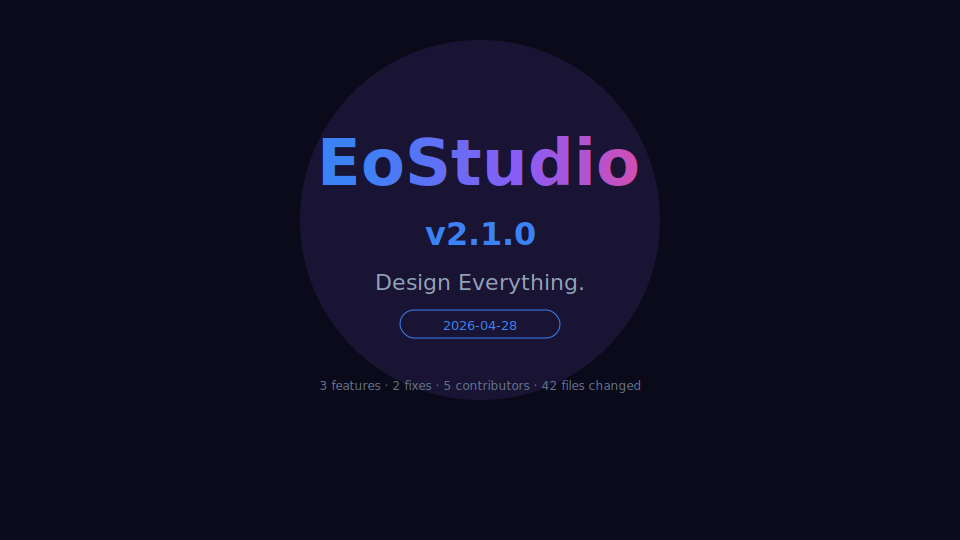
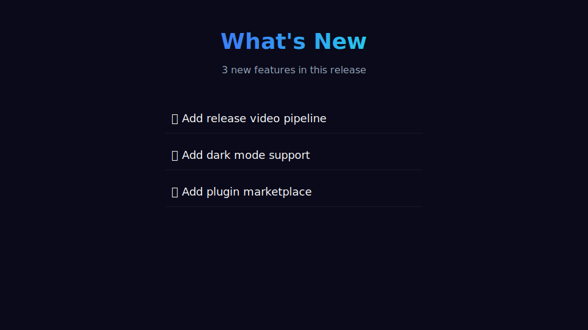
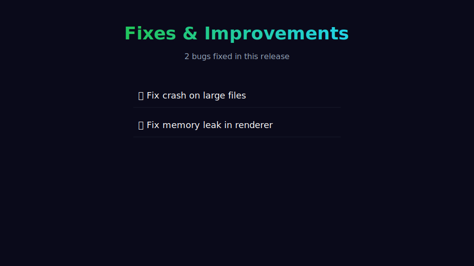
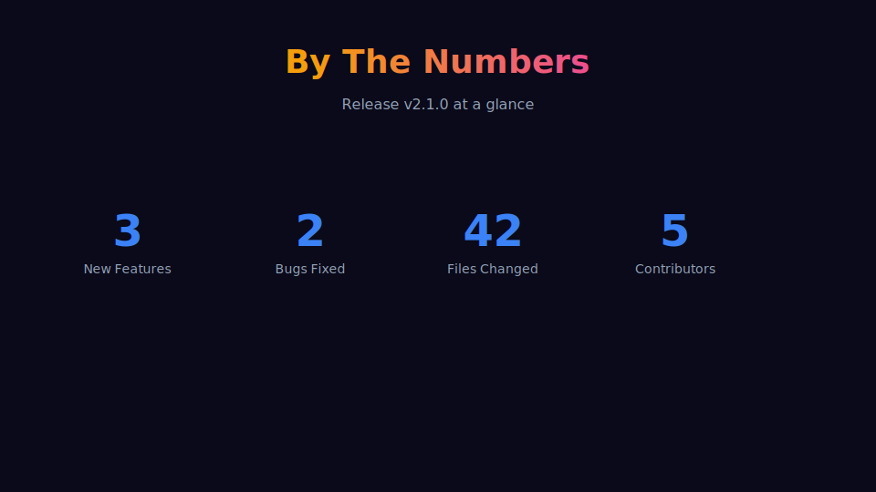
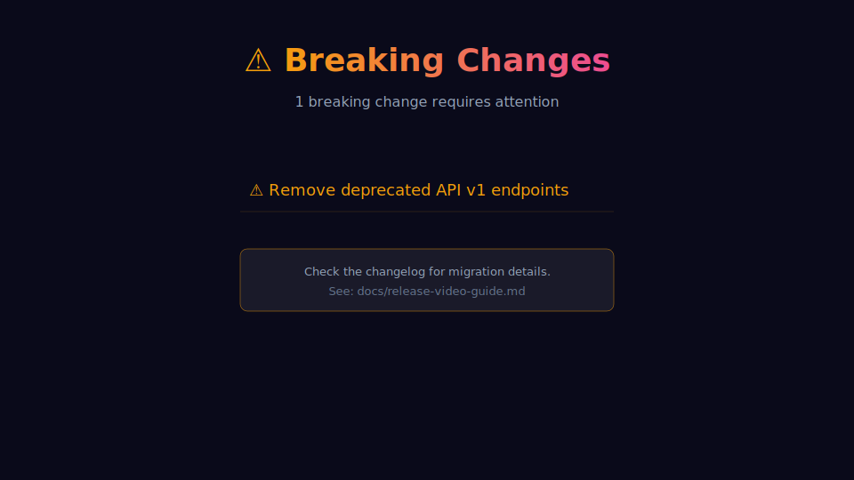
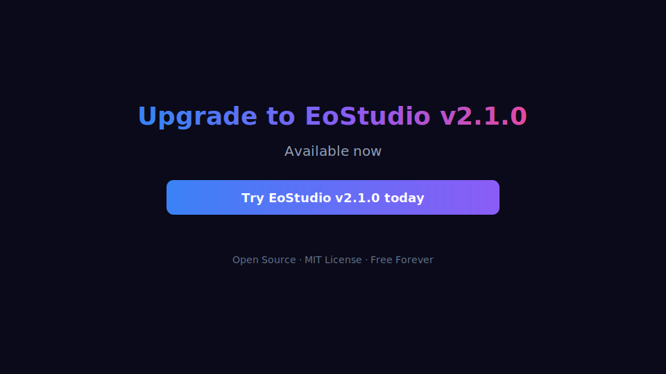

# Release Video Guide

> Automatically generate professional release videos from your git changelog — rendered with Manim, narrated with edge-tts, and integrated into CI/CD.

## Prerequisites

- **Python 3.10+**
- **ffmpeg** — video/audio processing
- **Manim Community** — scene rendering
- **edge-tts** — text-to-speech narration (optional)

```bash
# Ubuntu / Debian
sudo apt-get install -y ffmpeg libcairo2-dev libpango1.0-dev

# Install Python packages
pip install manim edge-tts
```

On macOS: `brew install ffmpeg cairo pango`. On Windows: download ffmpeg from [ffmpeg.org](https://ffmpeg.org/download.html) and add to PATH.

---

## CLI Usage

### Basic Usage

```bash
# Auto-detect version from the latest two git tags
EoStudio release-video

# Specify output directory
EoStudio release-video --output ./my-release-video

# Skip narration (video only, no TTS)
EoStudio release-video --no-narration
```

### All Options

```
EoStudio release-video [OPTIONS]

Options:
  --version TEXT        Version string (auto-detected from git tags if not set)
  --output, -o TEXT     Output directory (default: ./release-video)
  --voice TEXT          TTS voice name (default: en-US-GuyNeural)
  --no-narration        Skip TTS narration generation
  --from-tag TEXT       Start git tag (auto-detected if not set)
  --to-tag TEXT         End git tag (auto-detected if not set)
  --product-name TEXT   Product name for the video (default: EoStudio)
  --tagline TEXT        Tagline text for the hero slide
```

### Examples

```bash
# Generate video for a specific tag range
EoStudio release-video --from-tag v1.0.0 --to-tag v2.0.0

# Custom product name and tagline
EoStudio release-video --product-name "MyApp" --tagline "Build faster."

# Use a different TTS voice
EoStudio release-video --voice en-US-JennyNeural

# Full example
EoStudio release-video \
  --version 2.1.0 \
  --output ./artifacts/video \
  --product-name "EoStudio" \
  --tagline "Design Everything." \
  --voice en-US-GuyNeural
```

---

## What Gets Generated

The pipeline produces these artifacts in the output directory:

```
release-video/
├── release_scene.py                  # Generated Manim scene script
├── narration.mp3                     # Concatenated TTS narration (if enabled)
├── EoStudio_v2.1.0_release.mp4      # Final combined video
├── release_video_manifest.json       # Metadata manifest
├── narration_segments/               # Individual TTS segments
│   ├── seg_00.mp3
│   ├── seg_01.mp3
│   └── ...
└── videos/                           # Manim render output
    └── release_scene/
        └── 1080p30/
            └── ReleaseVideo.mp4
```

### Video Slides

The generated video contains 6 slides (5th is conditional). Here's an example for EoStudio v2.1.0:

#### Slide 1 — Hero

Product name with gradient title, version badge, tagline, and release date.



#### Slide 2 — What's New

Top features extracted from `feat:` commits (configurable, up to 6 by default).



#### Slide 3 — Fixes & Improvements

Bug fixes from `fix:` commits (up to 5).



#### Slide 4 — By The Numbers

Release statistics: feature count, bugs fixed, files changed, contributors.



#### Slide 5 — Breaking Changes *(conditional)*

Only included when `BREAKING CHANGE:` or `feat!:` commits are present.



#### Slide 6 — Call to Action

Closing slide with upgrade prompt and gradient button.



---

### Example: Full Pipeline Run

```bash
$ EoStudio release-video --version 2.1.0 --output ./release-artifacts/video

Generating release video for EoStudio v2.1.0...
  Features: 3, Fixes: 2, Contributors: 5

Release video generated:
  Video: ./release-artifacts/video/EoStudio_v2.1.0_release.mp4
  Audio: ./release-artifacts/video/narration.mp3
  Duration: 42.5s
```

The resulting directory:

```
release-artifacts/video/
├── release_scene.py                  # Manim scene (can be customized and re-rendered)
├── narration.mp3                     # Full narration audio
├── EoStudio_v2.1.0_release.mp4      # Final 1080p video with narration
├── release_video_manifest.json       # Machine-readable metadata
├── narration_segments/               # Individual TTS segments
│   ├── seg_00.mp3                    #   "Introducing EoStudio version 2.1.0..."
│   ├── sil_00.mp3                    #   1.0s pause
│   ├── seg_01.mp3                    #   "This release brings 3 new features..."
│   └── ...
└── videos/release_scene/1080p30/
    └── ReleaseVideo.mp4              # Raw Manim render (no audio)
```

### Manifest

The `release_video_manifest.json` contains:

```json
{
  "version": "2.1.0",
  "product_name": "EoStudio",
  "date": "2026-04-28",
  "duration_seconds": 42.5,
  "resolution": "1920x1080",
  "fps": 30,
  "video_path": "./release-video/EoStudio_v2.1.0_release.mp4",
  "changelog_summary": {
    "features": 3,
    "fixes": 2,
    "breaking_changes": 0,
    "contributors": 5,
    "files_changed": 42
  }
}
```

---

## Commit Convention

The changelog parser uses [Conventional Commits](https://www.conventionalcommits.org/). Tag your commits for best results:

| Prefix | Category | Video Slide |
|--------|----------|-------------|
| `feat:` | New feature | What's New |
| `fix:` | Bug fix | Fixes & Improvements |
| `feat!:` or `BREAKING CHANGE:` | Breaking change | Breaking Changes |
| `refactor:`, `docs:`, `chore:`, `perf:`, `test:`, `ci:` | Other | Not shown (counted in stats) |

Examples:

```
feat: add release video pipeline
fix: resolve crash on large files
feat!: remove deprecated API v1 endpoints
refactor: simplify animation engine internals
```

Version tags must follow `v*` format: `v1.0.0`, `v2.1.0`, etc.

---

## Python API

Use the generator programmatically for custom integrations:

```python
from eostudio.core.video.release_video import (
    ChangelogParser,
    ReleaseVideoConfig,
    ReleaseVideoGenerator,
)

# Parse changelog from git
parser = ChangelogParser("/path/to/repo")
changelog = parser.parse_latest_release()

# Or parse between specific tags
changelog = parser.parse_between_tags("v1.0.0", "v2.0.0")

# Configure
config = ReleaseVideoConfig(
    version=changelog.version,
    product_name="MyApp",
    tagline="Ship with confidence.",
    changelog=changelog,
    output_dir="./release-video",
    include_narration=True,
    voice="en-US-GuyNeural",
    voice_rate="-5%",
    resolution=(1920, 1080),
    fps=30,
    max_features_shown=6,
    max_duration=60.0,
    color_scheme={
        "bg": "#0a0a1a",
        "primary": "#3b82f6",
        "secondary": "#8b5cf6",
        "accent": "#ec4899",
    },
)

# Generate
gen = ReleaseVideoGenerator(config)
result = gen.generate()

print(f"Video: {result['final_video_path']}")
print(f"Duration: {result['manifest']['duration_seconds']}s")
```

### Generate Only the Manim Script

```python
gen = ReleaseVideoGenerator(config)
script = gen.generate_manim_script()

# Write and render manually
with open("my_release.py", "w") as f:
    f.write(script)

# Render with: manim render -qh my_release.py ReleaseVideo
```

### Generate Only the Narration Script

```python
gen = ReleaseVideoGenerator(config)
segments = gen.generate_narration_script()

for seg in segments:
    print(f"[{seg['pause_after']}s pause] {seg['text']}")
```

---

## CI/CD Integration

### GitHub Actions (built-in)

EoStudio includes a ready-to-use workflow at `.github/workflows/release-video.yml`. It triggers automatically when you push a version tag:

```bash
git tag v2.1.0
git push origin v2.1.0
# → Release video is generated and attached to the GitHub Release
```

The workflow:
1. Checks out the repo with full history
2. Installs ffmpeg, Manim, and edge-tts
3. Parses the changelog between the last two tags
4. Renders the video and generates TTS narration
5. Uploads the video as a GitHub Actions artifact
6. Attaches the MP4 to the GitHub Release

You can also trigger it manually from the Actions tab with optional inputs:
- **version** — override the version string
- **no_narration** — skip TTS narration

### Custom GitHub Actions Workflow

Add a release video step to your own workflow:

```yaml
- name: Generate release video
  run: |
    pip install manim edge-tts
    EoStudio release-video \
      --version ${{ github.ref_name }} \
      --output ./release-artifacts/video

- name: Upload video
  uses: actions/upload-artifact@v4
  with:
    name: release-video
    path: release-artifacts/video/*.mp4
```

### Programmatic Pipeline Builder

Use `PipelineBuilder` to generate CI/CD configs:

```python
from eostudio.core.devtools.cicd import create_release_with_video_pipeline

builder = create_release_with_video_pipeline(product_name="MyApp")
yaml = builder.to_github_actions_yaml()

with open(".github/workflows/release-video.yml", "w") as f:
    f.write(yaml)
```

This generates a 4-stage pipeline: **Test → Build → Video → Publish**.

### GitLab CI

```yaml
release-video:
  stage: deploy
  image: python:3.12
  rules:
    - if: $CI_COMMIT_TAG =~ /^v/
  before_script:
    - apt-get update && apt-get install -y ffmpeg libcairo2-dev libpango1.0-dev
    - pip install manim edge-tts
    - pip install -e .
  script:
    - EoStudio release-video --version ${CI_COMMIT_TAG#v} --output ./video
  artifacts:
    paths:
      - video/*.mp4
      - video/release_video_manifest.json
```

---

## Configuration Reference

### `ReleaseVideoConfig` Fields

| Field | Type | Default | Description |
|-------|------|---------|-------------|
| `version` | str | `"0.0.0"` | Version string |
| `product_name` | str | `"EoStudio"` | Product name shown in video |
| `tagline` | str | `""` | Tagline for hero slide |
| `changelog` | ReleaseChangelog | None | Parsed changelog data |
| `output_dir` | str | `"./release-video"` | Output directory |
| `resolution` | tuple | `(1920, 1080)` | Video resolution (width, height) |
| `fps` | int | `30` | Frames per second |
| `voice` | str | `"en-US-GuyNeural"` | edge-tts voice name |
| `voice_rate` | str | `"-5%"` | TTS speaking rate |
| `voice_pitch` | str | `"-4Hz"` | TTS pitch adjustment |
| `include_narration` | bool | `True` | Whether to generate TTS audio |
| `background_music_path` | str | None | Path to background music (not yet implemented) |
| `theme` | str | `"dark"` | Color theme |
| `color_scheme` | dict | *(see below)* | Custom color overrides |
| `max_features_shown` | int | `6` | Max features on the "What's New" slide |
| `max_duration` | float | `60.0` | Maximum video duration in seconds |

### Default Color Scheme

```python
{
    "bg": "#0a0a1a",
    "primary": "#3b82f6",
    "secondary": "#8b5cf6",
    "accent": "#ec4899",
    "text": "#ffffff",
    "muted": "#94a3b8",
}
```

### Available TTS Voices

Common English voices for edge-tts:

| Voice | Description |
|-------|-------------|
| `en-US-GuyNeural` | Male, natural American (default) |
| `en-US-JennyNeural` | Female, natural American |
| `en-US-AriaNeural` | Female, conversational |
| `en-GB-RyanNeural` | Male, British |
| `en-GB-SoniaNeural` | Female, British |
| `en-AU-WilliamNeural` | Male, Australian |

Run `edge-tts --list-voices` for the full list.

---

## Troubleshooting

### "Manim render failed: LaTeX not found"

Install a LaTeX distribution:

```bash
# Ubuntu
sudo apt-get install texlive texlive-latex-extra

# macOS
brew install --cask mactex-no-gui

# Or use Manim without LaTeX (Text objects work without it)
```

### "ffmpeg: command not found"

Install ffmpeg and ensure it's on your PATH:

```bash
# Ubuntu
sudo apt-get install ffmpeg

# macOS
brew install ffmpeg

# Verify
ffmpeg -version
```

### "Need at least 2 version tags"

The changelog parser requires two `v*` tags to compute a diff. Create tags first:

```bash
git tag v1.0.0  # baseline
git tag v1.1.0  # new release
```

Or specify tags manually:

```bash
EoStudio release-video --from-tag v1.0.0 --to-tag v1.1.0
```

### Video renders but has no audio

Ensure `edge-tts` is installed and you have internet access (edge-tts uses Microsoft's online TTS API). Use `--no-narration` for offline usage.
